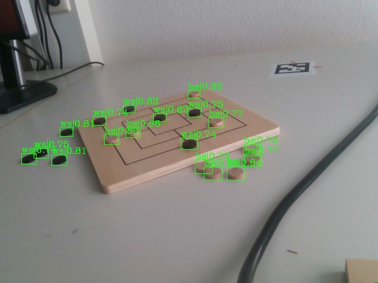
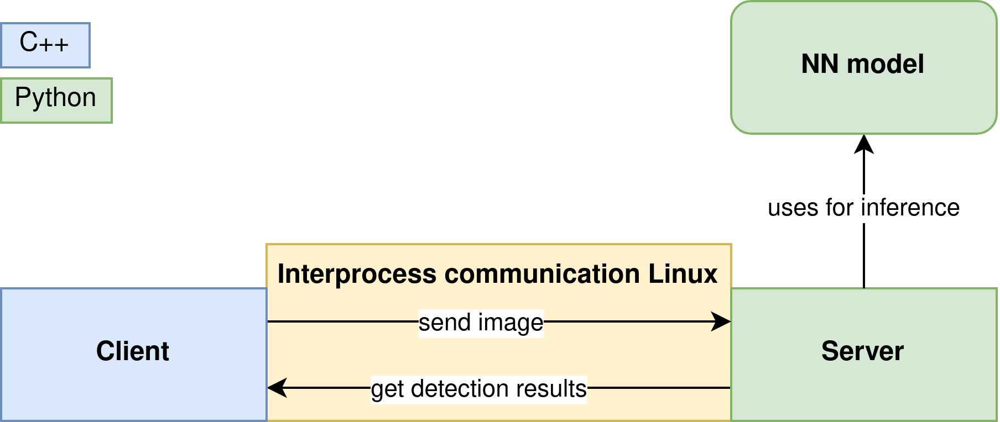
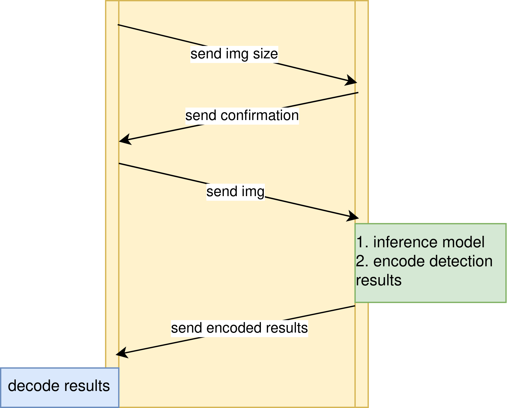

## Linux IPC for data exchange between C++ and Python
### Overview 
This repository illustrates a rapid and efficient method for facilitating data exchange between C++ and Python. It is particularly useful for integrating a Python-written neural network (NN) model into a C++ codebase, especially in situations where converting the NN model to the open format ONNX is not feasible.  

### Problem description
During a robotics project, where I designed a robot arm to play Nine Men's Morris on a physical game board using C++, I encountered a critical challenge. I had to create a lightweight object detection model to identify game stones on the board without the availability of a GPU.

    

    <em>Example image where the object detection should be performed</em>

The Ubuntu 20.12LTE operating system, with a real-time kernel controlling the Franka Emika Panda robot arm at 1 GHz, was employed. However, there was a limitation – the real-time kernel and the NVIDIA GPU could not be utilized simultaneously.

For the development of the object detection model, I used Python (PyTorch) and implemented the FasterRCNN, a prebuilt model in PyTorch. Following the training and validation steps, the model was ready for deployment. However, a hurdle emerged as the model could not be converted into the ONNX format, crucial for integration into C++, due to its origin in PyTorch.

Consequently, I sought a fast and efficient solution to address this issue.

    

    <em>Result of the stone detection using the developed NN model</em>

### Solution approach 

The initial concept involved capturing and storing the frame on which the detection was to be performed in a predetermined path using C++. Subsequently, a Python script would be executed to detect objects in the saved frame using the developed model, and the results would be saved in a JSON file within the same folder. The C++ driver code could then retrieve the results from the JSON file and proceed with the program.

However, this approach proved to be slow, as it necessitated overwriting the frame every time. To enhance efficiency, leveraging Linux interprocess communication is advantageous.

Linux Interprocess Communication (IPC) refers to a set of mechanisms and techniques that allow different processes to communicate and share data with each other on a Linux-based system. IPC is crucial for coordination and information exchange between processes running concurrently on the same machine. There are several IPC mechanisms in Linux, e.g Pipes, Message Queues, Sockets.

For my specific use case, I implemented a Server-Client communication system using sockets. The server, implemented in Python, serves as the NN model, receiving a frame and providing the detection results. On the other hand, the client is the C++ driver responsible for sending the frame on which the detection needs to be performed. The server listens for requests on a specific socket.

    

    <em>Overall structure of the Server-Client communication using Linux Interprocess Communication via a Socket</em>

Initially, the client transmits the size of the compressed image (frame) through the socket, indicating the data that will be sent to the server. Upon receiving the size, the server responds with a confirmation. Subsequently, the client sends the image to the server. The server, upon receiving the image, conducts the detection process and encodes the results – in our case, the bounding boxes, labels, and confidence scores of the detected stones. The encoded results are then transmitted back to the client via the socket. Upon receiving the encoded results, the client must decode them to continue with the program. This entire process is repeated whenever the client requires a detection of the stones.

    

    <em>Detailed figure of the communication between the Server and the Client</em>

### Conclusion
This repository offers a potential solution for facilitating communication between C++ and Python using Linux Interprocess Communication (IPC). If you come across a similar challenge, this repository can provide insights on implementing IPC. It's important to note that this repository doesn't present a generic IPC solution; rather, it serves as an example implementation for a specific use case.

For additional information about this project, kindly refer to the YouTube video accessible through the following link: https://www.youtube.com/watch?v=ms8xpr5FZS0. Alternatively, feel free to send me a message for further details.